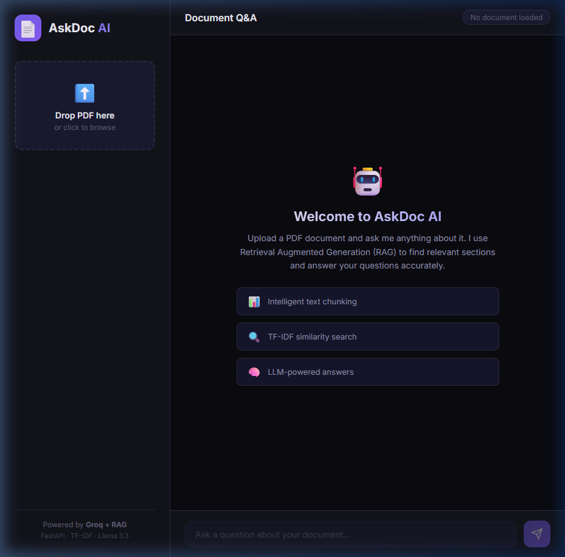

# AskDoc AI 📄🤖

**Enterprise Document Q&A Chatbot powered by RAG + LLM**

Upload any PDF document and ask questions about it. AskDoc AI uses Retrieval Augmented Generation (RAG) to find relevant sections and generate accurate, context-aware answers.



## Architecture

```
User uploads PDF
       │
       ▼
┌──────────────────┐
│  PDF Text        │  PyPDF2 extracts raw text
│  Extraction      │
└────────┬─────────┘
         │
         ▼
┌──────────────────┐
│  Text Chunking   │  Split into overlapping ~500 char chunks
│  (Smart Split)   │  with sentence-boundary awareness
└────────┬─────────┘
         │
         ▼
┌──────────────────┐
│  TF-IDF Index    │  Build term frequency-inverse document
│  Building        │  frequency vectors for each chunk
└────────┬─────────┘
         │
         ▼
   Document Ready!
         │
   User asks question
         │
         ▼
┌──────────────────┐
│  Similarity      │  Cosine similarity between query
│  Search          │  TF-IDF vector and chunk vectors
└────────┬─────────┘
         │
    Top 3 chunks
         │
         ▼
┌──────────────────┐
│  RAG Prompt      │  Inject retrieved context into
│  Assembly        │  structured LLM prompt
└────────┬─────────┘
         │
         ▼
┌──────────────────┐
│  LLM (Groq)     │  Llama 3.3 70B generates answer
│  Generation      │  grounded in document context
└────────┬─────────┘
         │
         ▼
   Answer + Sources
```

## Features

- **PDF Upload** — Drag and drop or click to upload any PDF document
- **Intelligent Chunking** — Splits text at sentence boundaries with configurable overlap
- **TF-IDF Retrieval** — No external embedding API needed; fast, local similarity search
- **RAG Pipeline** — Retrieved chunks are injected as context into the LLM prompt
- **Groq LLM** — Uses Llama 3.3 70B via Groq's API for fast, high-quality responses
- **Source Attribution** — Shows how many document chunks were used for each answer
- **Modern Chat UI** — Dark-themed, responsive interface with real-time feedback

## Tech Stack

| Component | Technology |
|-----------|-----------|
| Backend | FastAPI (Python) |
| LLM | Groq API (Llama 3.3 70B) |
| Retrieval | TF-IDF + Cosine Similarity |
| PDF Parsing | PyPDF2 |
| HTTP Client | httpx (async) |
| Frontend | Vanilla HTML/CSS/JS |

## Project Structure

```
askdoc-ai/
├── app/
│   ├── __init__.py
│   ├── main.py          # FastAPI endpoints (/upload, /chat, /health)
│   ├── config.py         # Environment configuration
│   └── rag.py            # RAG pipeline (chunking, indexing, retrieval)
├── static/
│   ├── index.html        # Chat interface
│   ├── style.css         # Dark theme styles
│   └── script.js         # Frontend logic
├── .env.example          # Environment template
├── .gitignore
├── requirements.txt
└── README.md
```

## Setup

```bash
# 1. Clone the repository
git clone https://github.com/ZentaCros/askdoc-ai.git
cd askdoc-ai

# 2. Install dependencies
pip install -r requirements.txt

# 3. Configure API key
cp .env.example .env
# Edit .env and add your Groq API key (free at https://console.groq.com)

# 4. Run the server
python -m uvicorn app.main:app --host 0.0.0.0 --port 8000

# 5. Open http://localhost:8000
```

## How It Works

1. **PDF Processing**: When a document is uploaded, PyPDF2 extracts the raw text. The text is then split into overlapping chunks (~500 characters each) using smart boundary detection that prefers splitting at sentence endings.

2. **Indexing**: Each chunk is converted into a TF-IDF (Term Frequency-Inverse Document Frequency) vector. This creates a searchable index without needing any external embedding API.

3. **Retrieval**: When the user asks a question, the query is also converted to a TF-IDF vector. Cosine similarity is computed between the query vector and all chunk vectors. The top 3 most relevant chunks are selected.

4. **Generation**: The retrieved chunks are assembled into a structured prompt with instructions for the LLM. The prompt is sent to Groq's API (Llama 3.3 70B), which generates a response grounded in the document context.

5. **Response**: The answer is displayed in the chat interface along with the number of source chunks used.

## API Endpoints

| Method | Endpoint | Description |
|--------|----------|-------------|
| GET | `/` | Serve frontend |
| GET | `/health` | Health check (document status, chunk count) |
| POST | `/upload` | Upload and process a PDF file |
| POST | `/chat` | Ask a question about the uploaded document |

## Challenges & Solutions

- **No External Embedding API**: Instead of relying on paid embedding APIs (OpenAI, Cohere), I implemented TF-IDF-based retrieval that runs entirely locally. This makes the system free to use and reduces latency.
- **Chunk Boundary Quality**: Naive character-based splitting breaks mid-sentence. I implemented smart boundary detection that finds the nearest sentence ending (period/newline) within the chunk window.
- **Async LLM Calls**: Used httpx async client with FastAPI to make non-blocking API calls to Groq, keeping the server responsive during LLM generation.

## Future Improvements

- [ ] Support for multiple document uploads
- [ ] Conversation memory (multi-turn chat)
- [ ] Vector database (FAISS/ChromaDB) for larger documents
- [ ] Azure OpenAI integration for enterprise deployment
- [ ] Docker containerization for cloud deployment

## Author

**Muhammad Hamza Azeem**
- GitHub: [ZentaCros](https://github.com/ZentaCros)
- LinkedIn: [hamza-azeem-data-scientist](https://linkedin.com/in/hamza-azeem-data-scientist-86a99925a)

## License

MIT
